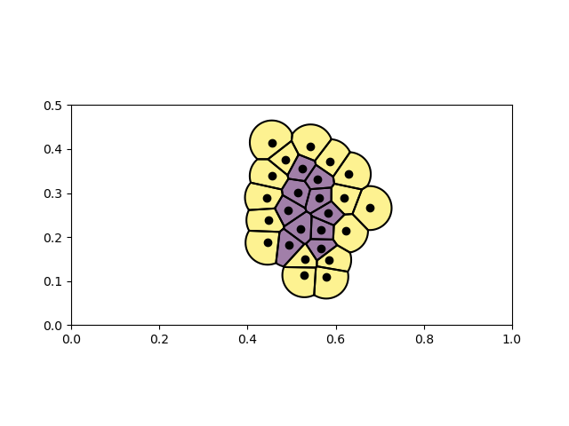

# Plot voronoi diagram where cells have a maximum radius in Python.

The python function plot_voronoi() in voronoi_max_radius.py plots a voronoi diagram where each cell has a maximum radius. The color of each cell can be set by the user. This functionality is similar to geom_voronoi_tile() from ggforce in R.

Examples.ipynb contains two examples.

Requirements: numpy, scipy, matplotlib, shapely

Example output:

